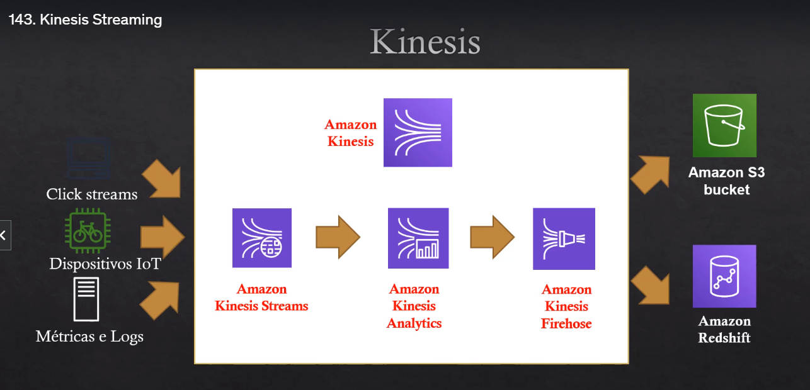

# Projeto_1
 
# Aplicações com Streaming - AWS Kinesis

### Tecnologias utilizadas:
 * Amazon Kinesis
 * Amazon S3
 * Python
 * Google Colab
 

### Biblioteca utilizada:
 * boto3

#### Visão geral AWS Kinesis:
- É uma alternativa gerenciada do Apache Kafka.
- Logs de aplicações, IOT, clickstreams
- Dados em "tempo real"

Kinesis Streams: Ingestão de streaming com baixa latência e em grande escala (streams 

diagrama

Criei um fluxo de dados no Amazon Kinesis
