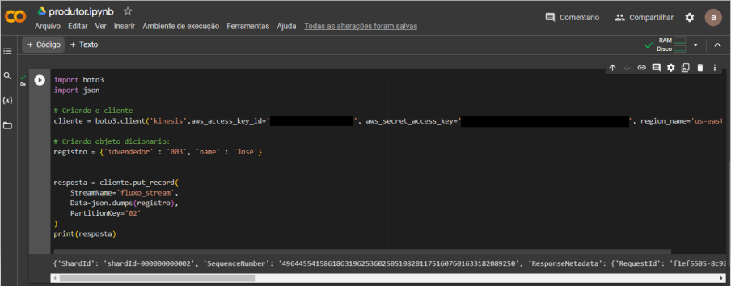
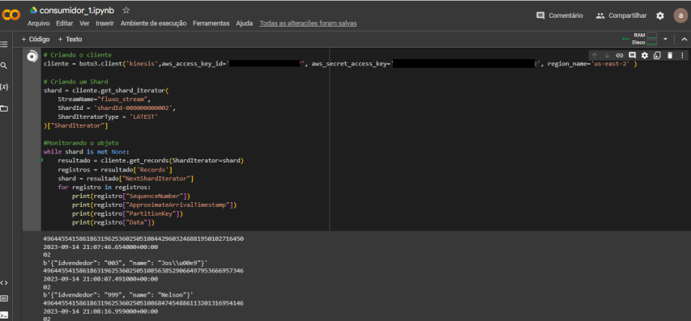

# Projeto com Amazon Kinesis

## Visão Geral

Este projeto demonstra a integração e uso do Amazon Kinesis, um serviço poderoso da Amazon Web Services (AWS) que possibilita a coleta, processamento e análise de dados em tempo real. O Amazon Kinesis é amplamente utilizado em cenários que exigem insights instantâneos a partir de grandes volumes de dados, como análise de streaming, detecção de fraudes e monitoramento em tempo real.

Neste projeto, exploramos dois dos principais componentes do Amazon Kinesis: **Amazon Kinesis Data Streams** e **Amazon Kinesis Data Firehose**. Vamos ver como criar, enviar e receber mensagens em tempo real usando esses serviços.

## Amazon Kinesis em Resumo

### Amazon Kinesis Data Streams

O **Amazon Kinesis Data Streams** é um serviço de ingestão de dados em tempo real que permite a captura de dados de várias fontes. Os dados são particionados em "shards" para facilitar o processamento paralelo e escalonável. Neste projeto, criamos uma primeira aplicação que envia mensagens para o Kinesis Data Streams e duas aplicações consumidoras que recebem essas mensagens em tempo real.

### Amazon Kinesis Data Firehose

O **Amazon Kinesis Data Firehose** simplifica o carregamento de dados em tempo real para destinos como Amazon S3, Amazon Redshift e Amazon Elasticsearch, entre outros. Na segunda parte do projeto, exploramos a criação de um fluxo de dados no Kinesis Data Firehose que direciona as mensagens para um bucket no Amazon S3. Observamos que o Amazon Kinesis Data Firehose entrega as mensagens com uma latência média de aproximadamente um minuto.

## Estrutura do Projeto

### Primeira Aplicação

Na primeira parte do projeto, realizamos as seguintes ações:

- [x] Criamos um fluxo de dados (Kinesis Data Streams) no Amazon Kinesis.

- [x] Desenvolvemos um produtor de mensagens em Python no ambiente Google Colab, com a instalação da biblioteca boto3. [Veja o script aqui](produtor.py)

- [x] Criamos dois consumidores no Google Colab, denominados Consumidor_1 e Consumidor_2, que recebem e processam as mensagens em tempo real. [Veja o script aqui](consumidor_1.py)

### Segunda Aplicação

Na segunda parte do projeto, abordamos os seguintes aspectos:

- [x] Configuramos o Amazon Kinesis Data Streams para enviar e receber mensagens.

- [x] Criamos um bucket no Amazon S3 para armazenar as mensagens.

## O que é o Amazon Kinesis?

O **Amazon Kinesis** é um serviço da AWS que possibilita a coleta, processamento e análise de dados em tempo real, incluindo streams de vídeo, logs e dados de sensores. Ele oferece escalabilidade, durabilidade e confiabilidade, sendo amplamente utilizado em uma variedade de casos de uso, desde análise de dados em tempo real até monitoramento de IoT.

Para saber mais sobre o Amazon Kinesis, consulte a [documentação oficial](https://docs.aws.amazon.com/kinesis/?icmpid=docs_homepage_analytics).

## Tecnologias Utilizadas

- Amazon Kinesis
- Amazon S3
- Python
- Google Colab

## Biblioteca Utilizada

- boto3

---

Este projeto serve como um guia básico para quem deseja começar a trabalhar com o Amazon Kinesis. Sinta-se à vontade para explorar o código-fonte e adaptá-lo às suas necessidades. Se tiver alguma dúvida ou sugestão, não hesite em entrar em contato.

**Por [Aurélia Covre](https://github.com/AuréliaCovre)**
